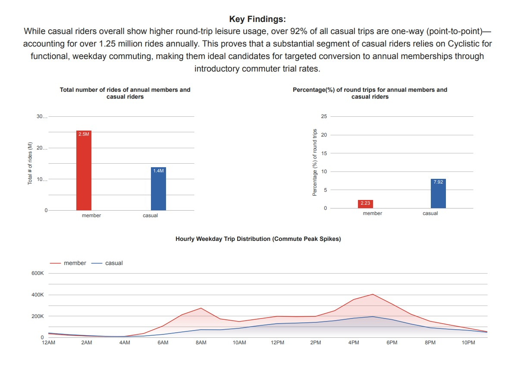

# Cyclistic Bike-Share Analysis

## Overview
This repository contains my capstone project for the Google Data Analytics Professional Certificate. The project analyzes bike-share usage patterns between casual riders and annual members to help inform marketing strategies.

## Data Analysis & Queries
* **SQL Cleaning & Auditing:** Included in the `.sql` files.
* **Presentation & Visualizations:** See the project summary image below or check `Cyclisstic Presentation - final.pdf`.

## Visual Highlights

